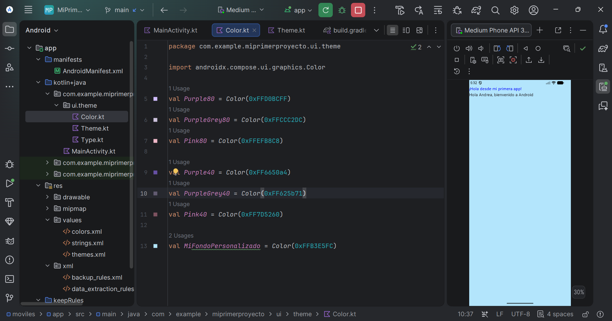
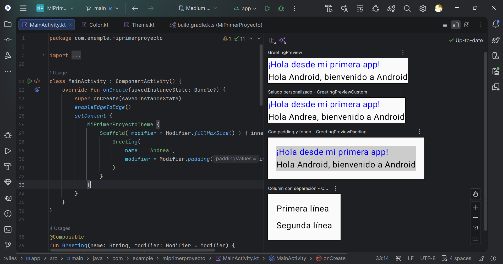
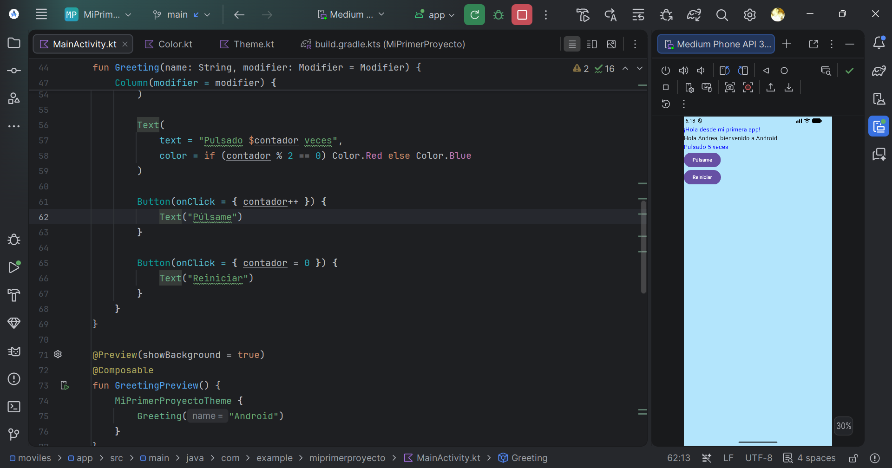
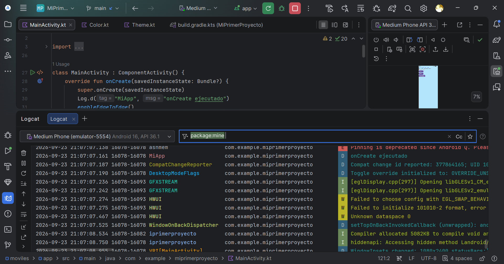
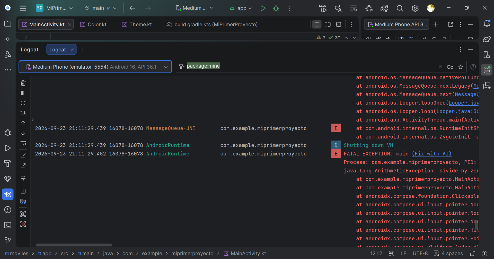
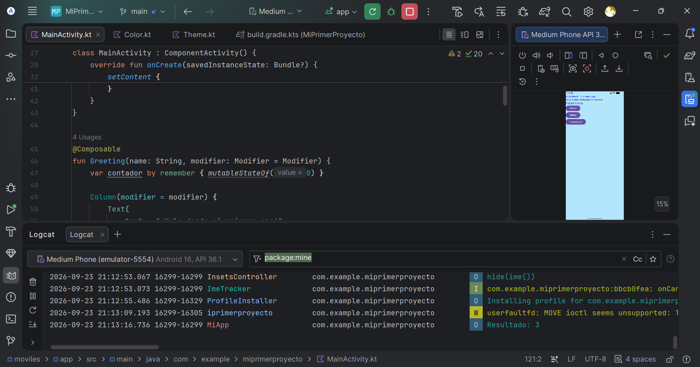

# Memoria — Mi primera app Android con Kotlin y Compose

**Alumno/a:** andrea milena vega mora
**Fecha:** 23/9/2026

## Tareas completadas

### Bloque 1 — Exploración guiada
- [x] Abre Android Studio y el proyecto MiPrimerAplicacion.
- [x] Localiza en el panel Project (vista Android): MainActivity.kt, strings.xml, build.gradle.kts (Module :app) y AndroidManifest.xml.
- [x] Abre MainActivity.kt y responde las preguntas de abajo.
- [x] Ejecuta la app en el AVD y comprueba que se ve el saludo por defecto.

### Bloque 2 — Personalización del saludo
- [x] Cambia el texto del saludo en la función Greeting:
- [x] Ejecuta la app y comprueba el cambio.
- [x] Cambia el nombre que se pasa desde MainActivity:
- [x] Observa que el texto ahora es dinámico (usa $name).
- [x] Añade un segundo Text debajo del primero con un mensaje distinto. Pista: envuelve ambos en una Column.
- [x] Cambia el color del texto usando color = Color.Blue en el Text.
- [x] Cambia el color de fondo del tema en ui/theme/Color.kt.

### Bloque 3 — Previews y organización
- [x] Añade una segunda @Preview con otro nombre:
- [x] Comprueba que en el panel Design aparecen las dos previews.
- [x] Añade una tercera preview con Modifier para ver el efecto del padding y el fondo:
- [x] Investiga y responde la pregunta de abajo.
- [x] Organiza el contenido en una Column con separación entre elementos:

### Bloque 4 — Interactividad: botón y contador
- [x] Añade un botón debajo del saludo:
- [x] Crea una variable de estado para contar pulsaciones:
- [x] Muestra el contador en un Text y actualízalo al pulsar el botón:
- [x] Ejecuta la app y comprueba que el contador aumenta.
- [x] Añade un segundo botón que reinicie el contador a 0. RETO EXTRA
- [x] Cambia el color del texto según el número de pulsaciones (rojo si es par, azul si es impar). RETO EXTRA

### Bloque 5 — Depuración con Logcat
- [x] Introduce un error deliberado en el código (por ejemplo, escribe Text(text = 42)).
- [x] Ejecuta la app y observa el error en el panel Build.
- [x] Corrige el error y vuelve a ejecutar.
- [x] Añade un log en el onCreate:
- [x] Abre el panel Logcat, filtra por MiApp y comprueba que aparece el mensaje.
- [x] Provoca un cierre inesperado (divide entre cero en un onClick) y busca FATAL EXCEPTION en Logcat.

### Bloque 6 — Documentación y entrega
- [x] Genera y descarga tu MEMORIA.md con el botón de abajo (incluye tus respuestas y el estado de las tareas).
- [x] Añade a mano las capturas de pantalla de cada bloque al archivo descargado.
- [x] Comprime el proyecto en un .zip (excluyendo build/ y .gradle/).

### Entregables
- [x] Enlace github a la actividad (opcional).#

https://github.com/mgd02452/PMDM26-27.git

- [x] MEMORIA.md con capturas, respuestas y reflexión personal.

## Respuestas y reflexión

**B1 — Clase y herencia**

se define la clase MainActivity
y se hereda de la clase ComposeActivity

**B1 — Método sobrescrito**

se sobrescribre onCreate(savedInstanceState: Bundle?)
se inicializa la interfaz de usuario

**B1 — Función en setContent**

se llama primero a MiPrimerProyectoTheme
luego se llama a Scaffold que a su vez llama a Greeting

**B1 — Para qué sirve @Preview**

crea una funcion para ver como se ve Greeting("Android") envuelto en el tema de la app sin que afecte al resto

**B3 — padding vs background**

padding añade espacio alrededor del contenido, empujando hacia adentro el área donde se dibuja lo que está dentro del Modifier. No pinta nada, solo reserva espacio.
background pinta un color (o forma) detrás del contenido, ocupando el tamaño que tenga el composable en ese momento.
primero se aplica el padding y luego el background se aplican en el orden que se han añadido

**Reflexión 1 — val vs var**

val declara una referencia inmutable (de solo lectura): una vez asignada, no se puede reasignar a otro valor. var declara una referencia mutable, que sí se puede reasignar tras su creación.

**Reflexión 2 — parámetro modifier**

modifier: Modifier = Modifier permite que quien llama a Greeting decida cómo se posiciona, dimensiona o decora ese composable desde fuera, sin que Greeting tenga que saber nada de eso internamente.

**Reflexión 3 — remember/mutableStateOf**

mutableStateOf da la reactividad (Compose "escucha" cambios), 
y remember da la persistencia dentro del ciclo de vida del composable (el valor no se pierde al recomponer).

**Reflexión 4 — @Composable vs @Preview**

@Composable define qué se puede dibujar
@Preview define qué se muestra en el editor sin ejecutar.

**Reflexión 5 — Logcat vs Build**

Logcat, muestra lo que pasa mientras la app se está ejecutando: mensajes de log que tú mismo insertas (Log.d), advertencias del sistema, y sobre todo excepciones en tiempo de ejecución (crashes) como ArithmeticException, NullPointerException, etc. — errores que el compilador no puede detectar de antemano porque dependen de datos o condiciones que solo se conocen al ejecutar (por ejemplo, que contador valga 0 en el momento de dividir). Logcat también incluye la traza de pila (stack trace) con la línea exacta donde ocurrió el fallo, algo que Build nunca muestra porque Build no ejecuta nada, solo compila.

**Reflexión 6 — dificultad encontrada**

se me ha dificultado la parte de poner los colores un poco ya que al principio no se veian por que eran tonos muy claros casi blancos, la parte de añadir los preview ya que al principio no me funcionaban ya que no me aparecian en el desin

## Capturas de pantalla

## Dificultades encontradas y cómo se resolvieron

Se me ha dificultado la parte de poner los colores un poco ya que al principio no se veian por que eran tonos muy claros casi blancos, la parte de añadir los preview ya que al principio no me funcionaban ya que no me aparecian en el desin

