# Memoria · Actividad 2.1 · Pantalla de Login y Navegación Básica (Jetpack Compose)

**Módulo:** Programación Multimedia y Dispositivos Móviles (PMDM) · 2º DAM **Alumna:** Andrea **Fecha:** 8 de octubre de 2026 **Repositorio GitHub:** (https://github.com/mgd02452/PMDM26-27)

## 1. Introducción y objetivos

En esta actividad se ha diseñado e implementado la pantalla de acceso (Login) de una aplicación Android usando **Jetpack Compose** y **Material 3**. Es la primera pantalla que ve el usuario, por lo que se ha cuidado tanto la interfaz como la experiencia de uso.

Objetivos específicos:

- Implementar una interfaz responsiva con `Column` y `Modifier`.
- Usar componentes de Material 3: `OutlinedTextField`, `Button`, `Checkbox`, `TextButton`.
- Programar la validación de email y contraseña.
- Gestionar el foco y el teclado.
- Navegar a una segunda pantalla (`HomeActivity`) mediante `Intent`.

### Competencias trabajadas

| CE | Descripción | Cómo se ha trabajado |
| --- | --- | --- |
| CE.a | Estrategia y estructura de clases de la aplicación | Separación en `MainActivity`, `LoginScreen`, `HomeActivity` y `HomeScreen`. |
| CE.b | Clases de interfaz gráfica | Composables con `Column`, `Row`, `OutlinedTextField`, `Button`, `Checkbox`. |
| CE.g | Pruebas de interacción y optimización en emuladores | Batería de pruebas en el emulador (apartado 6). |
| CE.i | Documentación de los procesos de desarrollo | Esta memoria y el repositorio en GitHub. |

## 2. Estructura del proyecto

Se ha organizado el proyecto de la siguiente forma:

| Archivo | Función |
| --- | --- |
| `AndroidManifest.xml` | Declara las Activities (`MainActivity`, `HomeActivity`), permisos y tema. |
| `MainActivity.kt` | Activity de entrada; carga `LoginScreen` con `setContent { }`. |
| `LoginScreen.kt` | Composable con la UI y la lógica de validación del login. |
| `HomeActivity.kt` | Activity que se abre tras un login correcto. |
| `HomeScreen.kt` | Composable con la UI de la pantalla de destino. |
| `res/values/strings.xml` | Todos los textos de la app (nada escrito a fuego en el código). |
| `res/values/colors.xml` y `themes.xml` | Colores y tema global. |

Se ha respetado la regla de oro de la guía: **los textos nunca se escriben directamente en el código**, sino que se referencian con `stringResource(R.string.…)`.


## 3. Desarrollo de la interfaz (LoginScreen.kt)

La pantalla se construye con una `Column` que ocupa toda la pantalla (`fillMaxSize()`), con `padding(24.dp)`, scroll vertical (`verticalScroll(rememberScrollState())`) y los elementos centrados horizontalmente. De arriba abajo contiene:

1. Logotipo (`Icon`) con `contentDescription` para accesibilidad.
2. Título de bienvenida con el estilo `headlineSmall` del tema.
3. Campo **Email** (`OutlinedTextField`) con teclado de tipo email.
4. Campo **Contraseña** con icono para mostrar u ocultar el texto (`Visibility` / `VisibilityOff`).
5. Fila con `Checkbox` y el texto "Recordar sesión".
6. Botón **ENTRAR** a todo el ancho.
7. `TextButton` "¿Olvidaste tu contraseña?".

Para los iconos se añadió la dependencia `material-icons-extended` en `libs.versions.toml` y en `build.gradle.kts`:

```kotlin
// libs.versions.toml
[libraries]
androidx-compose-material-icons-extended = { group = "androidx.compose.material", name = "material-icons-extended" }

// build.gradle.kts
dependencies {
    implementation(libs.androidx.compose.material.icons.extended)
}
```

**\[Captura 1: vista previa (@Preview) de LoginScreen\]**


## 4. Lógica y validación

### 4.1. Estado

Se usa `remember` y `mutableStateOf` para guardar el email, la contraseña, los mensajes de error y si la contraseña se muestra o no. Cada vez que cambia un estado, Compose recompone la interfaz.

### 4.2. Validación del email

Se comprueba que no esté vacío y que cumpla el patrón estándar de Android (`Patterns.EMAIL_ADDRESS`). Si no es válido, el campo se marca con `isError = true` y se muestra el mensaje con `supportingText`.

### 4.3. Validación de la contraseña

Se exige un mínimo de 8 caracteres, al menos una mayúscula y al menos un número, mediante la expresión regular `^(?=.*[A-Z])(?=.*[0-9]).{8,}$`.

### 4.4. Botón ENTRAR

Al pulsar el botón se validan ambos campos. Solo si los dos son correctos se quita el foco y se ejecuta `onLoginSuccess()`.

### 4.5. Navegación

`MainActivity` pasa a `LoginScreen` la lambda `onLoginSuccess`, que lanza un `Intent` hacia `HomeActivity`. En un proyecto real con Compose se usaría `NavHost`, pero aquí se emplea `Intent` por simplicidad. `HomeActivity` se registró en el Manifest con `android:exported="false"`.

**\[Captura 2: errores de validación en email\]** 


**\[Captura 3: errores de validación en contraseña\]** 


**\[Captura 4: pantalla Home tras un login correcto\]**


## 5. Gestión del foco y del teclado

- `ImeAction.Next` en el email: el teclado muestra "Siguiente" y `focusManager.moveFocus(FocusDirection.Down)` pasa al campo de contraseña.
- `ImeAction.Done` en la contraseña: el teclado muestra "Listo" y `focusManager.clearFocus()` cierra el teclado.
- `LaunchedEffect(Unit) { emailFocusRequester.requestFocus() }`: el foco inicial va al campo de email.
- `android:windowSoftInputMode="adjustResize"` en el Manifest para que el teclado no tape los campos inferiores.

Esto permite rellenar el formulario sin tocar la pantalla entre campos.

## 6. Pruebas en el emulador

| Caso probado | Resultado esperado | Resultado |
| --- | --- | --- |
| Al abrir la app, el foco está en el email | Teclado abierto sobre el email | \[OK\] |

| Email inválido | Error "Introduce un email válido" | \[OK\] |
| Contraseña débil | Error de requisitos mínimos | \[OK / KO\] |
| Botón mostrar/ocultar contraseña | Alterna el texto visible u oculto | \[OK\] |
| Tecla Siguiente en el email | Pasa a contraseña | \[OK\] |
| Tecla Listo en la contraseña | Cierra el teclado | \[OK\] |
| Datos correctos + ENTRAR | Abre `HomeActivity` | \[OK\] |

**\[Captura 5: pruebas en el emulador\]**

**\[Rotacion de pantalla\]**


**\[TalkBack activo\]**


## 7. Limpieza de cadenas de texto localizables

En el código de ejemplo los mensajes de error de validación estaban escritos a fuego ("Introduce un email válido" y "Mínimo 8 caracteres, una mayúscula y un número"). Se han movido a `strings.xml`, donde ya existían como `error_email` y `error_password`. Como las funciones de validación no son `@Composable`, los textos se leen antes con `stringResource` y se usan dentro de ellas:

```kotlin
val errorEmailMsg = stringResource(R.string.error_email)
val errorPasswordMsg = stringResource(R.string.error_password)

fun validarEmail(): Boolean {
    val emailValido = email.isNotBlank() &&
            Patterns.EMAIL_ADDRESS.matcher(email.trim()).matches()
    emailError = if (!emailValido) errorEmailMsg else null
    return emailValido
}

fun validarPassword(): Boolean {
    val regex = "^(?=.*[A-Z])(?=.*[0-9]).{8,}$".toRegex()
    val passValida = regex.matches(password)
    passwordError = if (!passValida) errorPasswordMsg else null
    return passValida
}
```

```xml
<string name="error_email">Introduce un email válido</string>
<string name="error_password">Mínimo 8 caracteres, una mayúscula y un número</string>
```

Así, para traducir la app solo hay que crear `res/values-en/strings.xml` con los mismos nombres y el código no cambia.

## 8. Funcionalidad del checkbox (opcional)

En el ejemplo, el `Checkbox` tenía `checked = false` fijo, por lo que no se podía marcar. Se ha añadido un estado para que se pueda marcar y desmarcar, y que su valor se conserve entre recomposiciones (y también al rotar la pantalla usando `rememberSaveable`):

```kotlin
var recordarSesion by rememberSaveable { mutableStateOf(false) }

Row(
    verticalAlignment = Alignment.CenterVertically,
    modifier = Modifier.fillMaxWidth()
) {
    Checkbox(
        checked = recordarSesion,
        onCheckedChange = { recordarSesion = it }
    )
    Text(stringResource(R.string.recordar_sesion))
}
```

Imports necesarios: `androidx.compose.runtime.saveable.rememberSaveable`.

**\[Captura 6: checkbox marcado\]**


## 9. Retos 

### Reto 1: Mover el botón "¿Olvidaste tu contraseña?

**\[Enunciado: El enlace está centrado debajo del botón. Queremos que se coloque alineado a la derecha, justo debajo del botón, y que siga viéndose en horizontal.\]**

**\[Solucion: Para mover el botón y alinearlo a la derecha del contenedor principal (Column), se aplicó el modificador Modifier.align(Alignment.End) directamente al componente TextButton. Al estar dentro de una Column, este modificador permite alinear el elemento de manera individual al margen derecho sin afectar la alineación centrada global de la pantalla.\]**

**\[Codigo: \]**

```kotlin
package com.example.login

import android.content.res.Configuration
import android.util.Patterns
import androidx.compose.foundation.layout.*
import androidx.compose.foundation.rememberScrollState
import androidx.compose.foundation.text.KeyboardActions
import androidx.compose.foundation.text.KeyboardOptions
import androidx.compose.foundation.verticalScroll
import androidx.compose.material.icons.Icons
// [RETO 3]: Importación de los nuevos iconos de candado
import androidx.compose.material.icons.filled.Lock
import androidx.compose.material.icons.filled.LockOpen
import androidx.compose.material3.*
import androidx.compose.runtime.*
import androidx.compose.runtime.saveable.rememberSaveable
import androidx.compose.ui.Alignment
import androidx.compose.ui.Modifier
import androidx.compose.ui.focus.FocusDirection
import androidx.compose.ui.focus.FocusRequester
import androidx.compose.ui.focus.focusRequester
import androidx.compose.ui.platform.LocalFocusManager
import androidx.compose.ui.res.painterResource
import androidx.compose.ui.res.stringResource
import androidx.compose.ui.text.input.ImeAction
import androidx.compose.ui.text.input.KeyboardType
import androidx.compose.ui.text.input.PasswordVisualTransformation
import androidx.compose.ui.text.input.VisualTransformation
import androidx.compose.ui.tooling.preview.Preview
import androidx.compose.ui.unit.dp
import com.example.login.ui.theme.LoginTheme

@Composable
fun LoginScreen(
    onLoginSuccess: () -> Unit
) {
    // Estado inicial de campos
    var email by remember { mutableStateOf("") }
    var password by remember { mutableStateOf("") }

    // [RETO 5]: Nuevos estados para la confirmación de contraseña
    var confirmPassword by remember { mutableStateOf("") }
    var confirmPasswordError by remember { mutableStateOf<String?>(null) }
    var showConfirmPassword by remember { mutableStateOf(false) }

    var emailError by remember { mutableStateOf<String?>(null) }
    var passwordError by remember { mutableStateOf<String?>(null) }

    var showPassword by remember { mutableStateOf(false) }
    var recordar by rememberSaveable { mutableStateOf(false) }

    val focusManager = LocalFocusManager.current
    val emailFocusRequester = remember { FocusRequester() }

    LaunchedEffect(Unit) {
        emailFocusRequester.requestFocus()
    }

    // [RETO 4]: Funciones puras de comprobación
    fun esEmailValido(textoEmail: String): Boolean {
        return textoEmail.isNotBlank() && Patterns.EMAIL_ADDRESS.matcher(textoEmail.trim()).matches()
    }

    fun esPasswordValida(textoPassword: String): Boolean {
        val regex = "^(?=.*[A-Z])(?=.*[0-9]).{8,}$".toRegex()
        return regex.matches(textoPassword)
    }

    // [RETO 5]: Comprobación de que ambas contraseñas coincidan y no estén vacías
    fun esConfirmPasswordValida(pass: String, confirmPass: String): Boolean {
        return confirmPass.isNotEmpty() && pass == confirmPass
    }

    // Funciones de validación para asignar o limpiar mensajes de error
    fun validarEmail(): Boolean {
        val valido = esEmailValido(email)
        emailError = if (!valido) "Introduce un email válido" else null
        return valido
    }

    fun validarPassword(): Boolean {
        val valida = esPasswordValida(password)
        passwordError = if (!valida) {
            "Mínimo 8 caracteres, una mayúscula y un número"
        } else null
        return valida
    }

    // [RETO 5]: Asignar mensaje de error de confirmación
    fun validarConfirmPassword(): Boolean {
        val coincide = esConfirmPasswordValida(password, confirmPassword)
        confirmPasswordError = if (!coincide) {
            "Las contraseñas no coinciden"
        } else null
        return coincide
    }

    // [RETO 4 y 5]: Estado derivado que determina si todo el formulario es válido (los 3 campos)
    val isFormValid by remember(email, password, confirmPassword) {
        derivedStateOf {
            esEmailValido(email) && esPasswordValida(password) && esConfirmPasswordValida(password, confirmPassword)
        }
    }

    // [RETO 7]: Envolvemos la pantalla en un Surface con el color de fondo del tema
    Surface(
        modifier = Modifier.fillMaxSize(),
        color = MaterialTheme.colorScheme.background
    ) {
        Column(
            modifier = Modifier
                .fillMaxSize()
                .padding(24.dp)
                .verticalScroll(rememberScrollState()),
            horizontalAlignment = Alignment.CenterHorizontally,
            verticalArrangement = Arrangement.Top
        ) {
            Spacer(modifier = Modifier.height(48.dp))

            Icon(
                painter = painterResource(id = R.drawable.ic_launcher_foreground),
                contentDescription = stringResource(R.string.logo_desc),
                modifier = Modifier.size(120.dp),
                // [RETO 7]: Tinte del icono según el color primario del tema
                tint = MaterialTheme.colorScheme.primary
            )

            Spacer(modifier = Modifier.height(24.dp))

            Text(
                text = stringResource(R.string.titulo_bienvenida),
                style = MaterialTheme.typography.headlineSmall,
                // [RETO 7]: Color dinámico adaptado al tema (onBackground)
                color = MaterialTheme.colorScheme.onBackground
            )

            Spacer(modifier = Modifier.height(32.dp))

            // Campo 1: EMAIL
            OutlinedTextField(
                value = email,
                onValueChange = {
                    email = it
                    if (it.isNotEmpty()) validarEmail()
                },
                label = { Text(stringResource(R.string.hint_email)) },
                isError = emailError != null,
                supportingText = emailError?.let { { Text(it) } },
                keyboardOptions = KeyboardOptions(
                    keyboardType = KeyboardType.Email,
                    imeAction = ImeAction.Next
                ),
                keyboardActions = KeyboardActions(
                    onNext = {
                        focusManager.moveFocus(FocusDirection.Down)
                    }
                ),
                modifier = Modifier
                    .fillMaxWidth()
                    .focusRequester(emailFocusRequester)
            )

            Spacer(modifier = Modifier.height(16.dp))

            // Campo 2: CONTRASEÑA
            OutlinedTextField(
                value = password,
                onValueChange = {
                    password = it
                    if (it.isNotEmpty()) validarPassword()
                    // [RETO 5]: Revalidar la confirmación si se cambia la contraseña principal
                    if (confirmPassword.isNotEmpty()) validarConfirmPassword()
                },
                label = { Text(stringResource(R.string.hint_password)) },
                isError = passwordError != null,
                supportingText = passwordError?.let { { Text(it) } },
                visualTransformation = if (showPassword) {
                    VisualTransformation.None
                } else {
                    PasswordVisualTransformation()
                },
                trailingIcon = {
                    IconButton(onClick = { showPassword = !showPassword }) {
                        Icon(
                            // [RETO 3]: Uso de los iconos personalizados de candado
                            imageVector = if (showPassword) Icons.Filled.LockOpen else Icons.Filled.Lock,
                            contentDescription = stringResource(R.string.toggle_password)
                        )
                    }
                },
                keyboardOptions = KeyboardOptions(
                    keyboardType = KeyboardType.Password,
                    imeAction = ImeAction.Next // [RETO 5]: Cambiado a Next
                ),
                keyboardActions = KeyboardActions(
                    onNext = {
                        focusManager.moveFocus(FocusDirection.Down)
                    }
                ),
                modifier = Modifier.fillMaxWidth()
            )

            Spacer(modifier = Modifier.height(16.dp))

            // Campo 3: [RETO 5] CONFIRMAR CONTRASEÑA
            OutlinedTextField(
                value = confirmPassword,
                onValueChange = {
                    confirmPassword = it
                    if (it.isNotEmpty()) {
                        validarConfirmPassword()
                    } else {
                        confirmPasswordError = null
                    }
                },
                label = { Text(stringResource(R.string.hint_confirm_password)) },
                isError = confirmPasswordError != null,
                supportingText = confirmPasswordError?.let { { Text(it) } },
                visualTransformation = if (showConfirmPassword) {
                    VisualTransformation.None
                } else {
                    PasswordVisualTransformation()
                },
                trailingIcon = {
                    IconButton(onClick = { showConfirmPassword = !showConfirmPassword }) {
                        Icon(
                            imageVector = if (showConfirmPassword) Icons.Filled.LockOpen else Icons.Filled.Lock,
                            contentDescription = stringResource(R.string.toggle_password)
                        )
                    }
                },
                keyboardOptions = KeyboardOptions(
                    keyboardType = KeyboardType.Password,
                    imeAction = ImeAction.Done
                ),
                keyboardActions = KeyboardActions(
                    onDone = {
                        focusManager.clearFocus()
                    }
                ),
                modifier = Modifier.fillMaxWidth()
            )

            Spacer(modifier = Modifier.height(8.dp))

            Row(
                verticalAlignment = Alignment.CenterVertically,
                modifier = Modifier.fillMaxWidth()
            ) {
                Checkbox(
                    checked = recordar,
                    onCheckedChange = { recordar = it }
                )
                Text(
                    text = stringResource(R.string.recordar_sesion),
                    color = MaterialTheme.colorScheme.onBackground
                )
            }

            Spacer(modifier = Modifier.height(24.dp))

            // BOTÓN ENTRAR
            Button(
                onClick = {
                    if (isFormValid) {
                        focusManager.clearFocus()
                        onLoginSuccess()
                    }
                },
                // [RETO 4]: Bloqueado hasta que el formulario sea totalmente válido
                enabled = isFormValid,
                modifier = Modifier.fillMaxWidth()
            ) {
                Text(stringResource(R.string.boton_entrar))
            }

            Spacer(modifier = Modifier.height(16.dp))

            // BOTÓN "¿Olvidaste tu contraseña?"
            TextButton(
                onClick = { /* Acción */ },
                // [RETO 1]: Mover el botón alineándolo a la derecha (Alignment.End)
                modifier = Modifier.align(Alignment.End)
            ) {
                Text(stringResource(R.string.olvidaste_password))
            }
        }
    }
}
// [RETO 7]: Previsualización en Modo Claro
@Preview(name = "Light Mode", showBackground = true)
@Composable
fun LoginScreenLightPreview() {
    LoginTheme { // Cambiado MaterialTheme por LoginTheme (o el tema de tu app)
        LoginScreen(onLoginSuccess = {})
    }
}

// [RETO 7]: Previsualización en Modo Oscuro
@Preview(
    name = "Dark Mode",
    showBackground = true,
    uiMode = Configuration.UI_MODE_NIGHT_YES
)
@Composable
fun LoginScreenDarkPreview() {
    LoginTheme { // Cambiado MaterialTheme por LoginTheme (o el tema de tu app)
        LoginScreen(onLoginSuccess = {})
    }
}
```

**\[Captura Reto 1"\]**

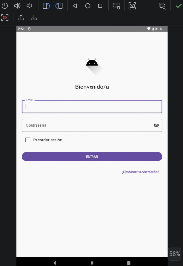

### Reto 3: Añadir un icono personalizado en la contraseña

**\[Enunciado: Ahora mismo el icono del ojo usa Icons.Filled.Visibility. Queremos cambiarlo por otros iconos de material-icons-extended, por ejemplo un candado.\]**

**\[Solucion: Se importaron los iconos Icons.Filled.Lock y Icons.Filled.LockOpen de la librería de Material Icons. Posteriormente, en la propiedad trailingIcon del campo OutlinedTextField de la contraseña, se sustituyó el icono del ojo anterior por un condicional que cambia dinámicamente entre el candado cerrado (Lock) y abierto (LockOpen) según el estado de la variable booleana showPassword.\]**

**\[Captura Reto 1"\]**

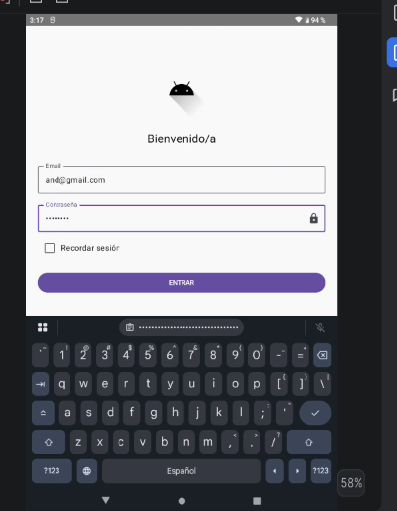

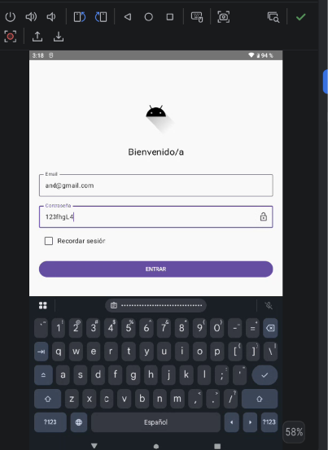

### Reto 4: Bloquear el botón hasta que el formulario sea válido

**\[Enunciado: Queremos que el botón ENTRAR esté deshabilitado (en gris, sin poder pulsarse) hasta que tanto el email como la contraseña sean válidos. En cuanto ambos sean válidos, el botón se habilita automáticamente.\]**

**\[Solucion: Se definió una variable de estado derivado isFormValid mediante derivedStateOf, la cual valida que tanto el formato de email como los requisitos de contraseña sean correctos en tiempo real. Esta variable se asignó a la propiedad enabled del componente Button (enabled = isFormValid), deshabilitando automáticamente el botón en gris mientras alguno de los campos no sea válido.\]**

**\[Captura Reto 4"\]**

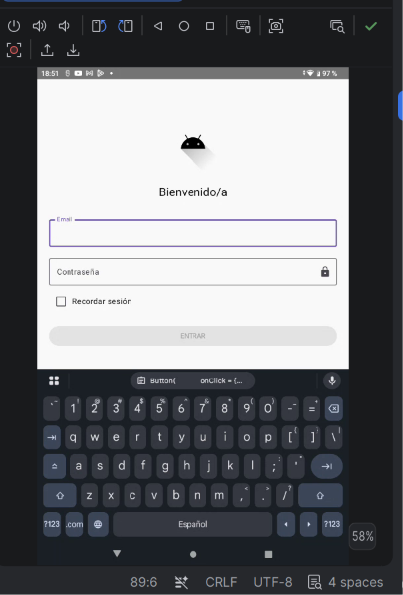

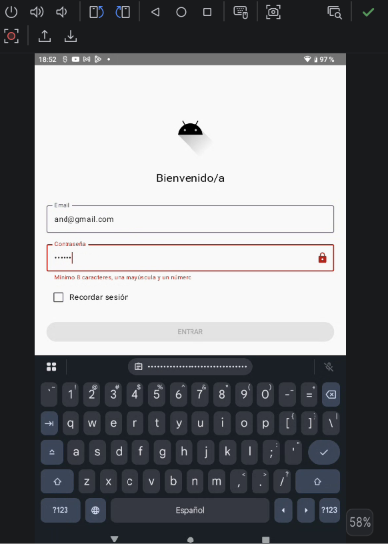

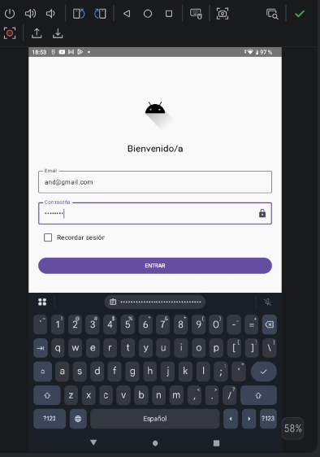

### Reto 5: Añadir un tercer campo "Confirmar contraseña"

**\[Enunciado: Añade un campo "Confirmar contraseña" que compruebe que es idéntico al de contraseña, mostrando error en el campo de confirmación si no coincide.\]**

**\[Solucion: Se añadió un nuevo estado confirmPassword y una función pura de comprobación esConfirmPasswordValida() que verifica que este campo no esté vacío y que coincida exactamente con la contraseña introducida. Se integró un tercer OutlinedTextField configurado con acción del teclado ImeAction.Done y se incluyó la validación dentro de la condición global de isFormValid para asegurar la coherencia antes de permitir el inicio de sesión.\]**

**\[Captura Reto 5"\]**


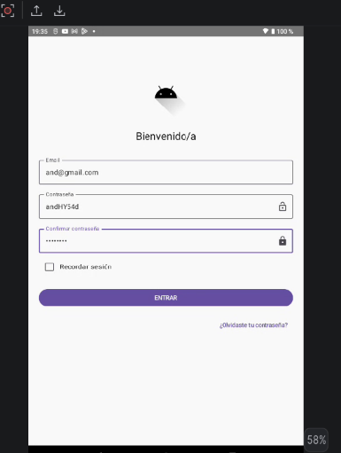

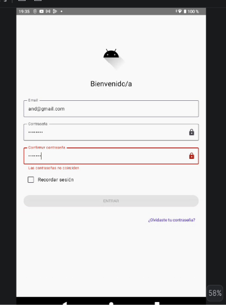

### Reto 6: Traducir la pantalla al inglés

**\[Enunciado: La app debe mostrarse en inglés cuando el móvil esté en inglés, sin tocar layout ni Kotlin, solo recursos.\]**

**\[Solucion: Se creó un archivo alternativo de recursos de cadenas strings.xml dentro del directorio res/values-en/. En este archivo se tradujeron todas las claves existentes (como etiquetas de entrada, títulos, botones y mensajes de error) al inglés, permitiendo que la interfaz se adapte automáticamente al idioma configurado en el dispositivo sin necesidad de modificar el código Kotlin.\]**

**\[Codigo: \]**

```kotlin
<?xml version="1.0" encoding="utf-8"?>
<resources>
    <string name="app_name">MiApp</string>
    <string name="logo_desc">Aplication logo</string>
    <string name="titulo_bienvenida">Welcome</string>
    <string name="hint_email">Email</string>
    <string name="hint_password">Password</string>
    <string name="hint_confirm_password">Confirm Password</string>
    <string name="error_confirm_password">Passwords do not match</string>
    <string name="recordar_sesion">Remember sesion</string>
    <string name="boton_entrar">LOG IN</string>
    <string name="olvidaste_password">Forgot your password?</string>
    <string name="toggle_password">Show or hide password</string>
    <string name="error_email">Enter a valid email address</string>
    <string name="error_password">Minimum 8 characters, one uppercase letter, and one number</string>
    <string name="login_correcto">Successful login</string>
    <string name="titulo_home">Welcome Home!</string>
</resources>
```

**\[Captura Reto 6"\]**

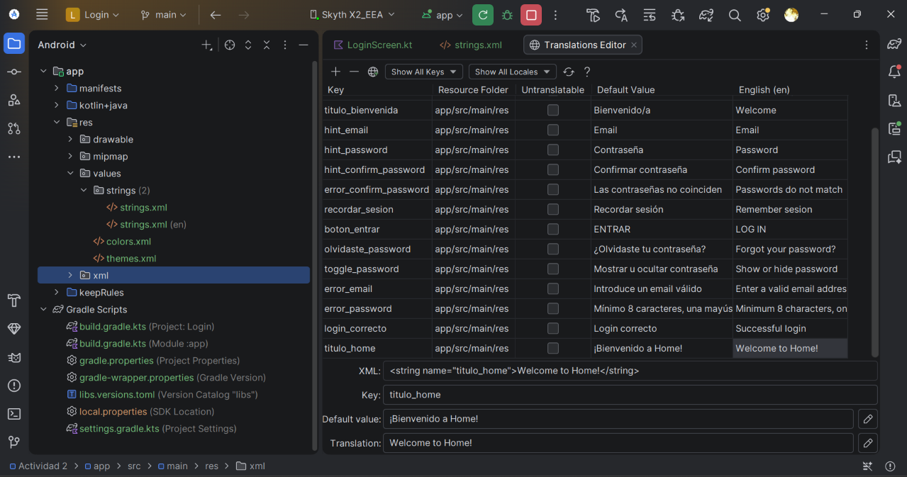

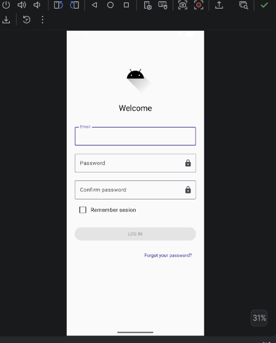

### Reto 7: Tema claro / oscuro

**\[Enunciado: La app debe soportar modo oscuro automáticamente: fondos oscuros y textos claros en modo oscuro, y al revés en modo claro.\]**

**\[Solucion: Se envolvió el diseño principal de la pantalla dentro de un componente Surface que utiliza MaterialTheme.colorScheme.background como color de fondo. Además, se configuraron los colores de textos e iconos con valores semánticos dinámicos (onBackground, primary). Finalmente, se añadieron anotaciones @Preview específicas configurando uiMode = Configuration.UI_MODE_NIGHT_YES para verificar la adaptación visual en el entorno de desarrollo.\]**

**\[Captura Reto 7"\]**

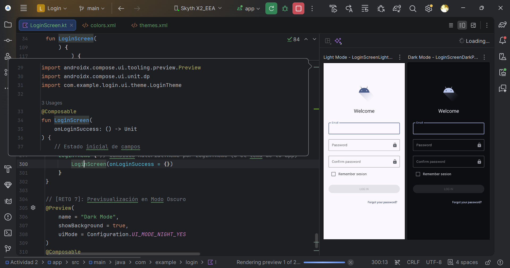

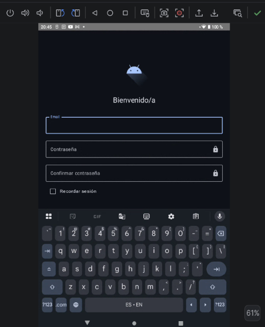

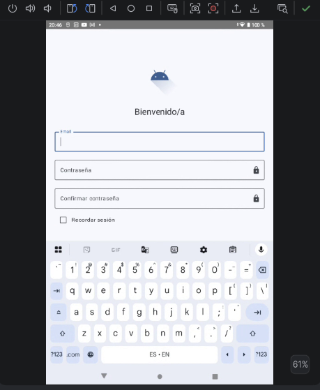

### Reto 8: Navegación con NavHost

**\[Ahora la navegación se hace con Intent. Queremos migrar a NavHost (navigation-compose), la forma recomendada en proyectos Compose modernos.\]**

**\[Solucion: Se sustituyó la navegación imperativa mediante Intent por el componente NavHost de navigation-compose. Se creó una clase sellada Screen para definir las rutas (login_screen y home_screen) y se configuró AppNavigation() para controlar la pila de pantallas. Al iniciar sesión correctamente, se ejecuta navController.navigate aplicando popUpTo con inclusive = true para remover la pantalla de login del historial y evitar que el usuario regrese a ella con el botón "Atrás".\]**

**\[Codigo: \]**

```kotlin
package com.example.login

import androidx.compose.runtime.Composable
import androidx.navigation.compose.NavHost
import androidx.navigation.compose.composable
import androidx.navigation.compose.rememberNavController

// Definimos una clase sellada para representar los destinos posibles de la app
sealed class Screen(val route: String) {
    object Login : Screen("login_screen")
    object Home : Screen("home_screen")
}

@Composable
fun AppNavigation() {
    // 1. Controlador de navegación que lleva el historial
    val navController = rememberNavController()

    // 2. Contenedor de pantallas
    NavHost(
        navController = navController,
        startDestination = Screen.Login.route // Pantalla inicial
    ) {
        // Ruta 1: LoginScreen
        composable(route = Screen.Login.route) {
            LoginScreen(
                onLoginSuccess = {
                    // Al iniciar sesión con éxito, navegamos a Home
                    navController.navigate(Screen.Home.route) {
                        // Eliminamos Login del historial para que al pulsar 'Atrás' no vuelva al login
                        popUpTo(Screen.Login.route) { inclusive = true }
                    }
                }
            )
        }

        // Ruta 2: HomeScreen
        composable(route = Screen.Home.route) {
            HomeScreen()
        }
    }
}
```

**\[Captura Reto 8"\]**

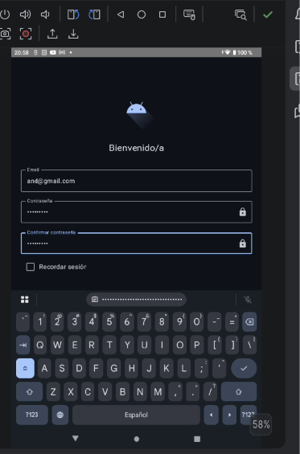

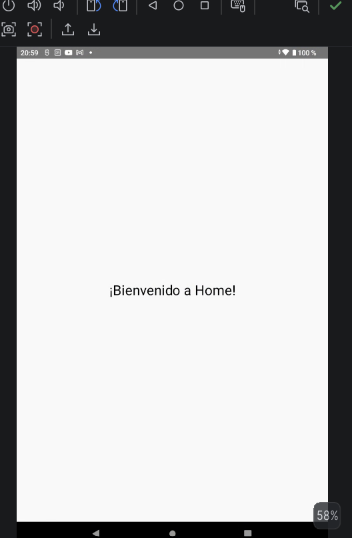

## 10. Accesibilidad

- Los elementos gráficos tienen `contentDescription` (logo y botón de mostrar/ocultar contraseña) para que TalkBack los lea.
- Los botones respetan el tamaño táctil mínimo de 48dp × 48dp.
- Los errores no se comunican solo con color: se muestra también un texto de apoyo (`supportingText`).
- Se recomienda comprobar el contraste (WCAG AA, 4.5:1) y probar con TalkBack.

## 11. Problemas encontrados y soluciones

| Problema | Solución |
| --- | --- |
| `Unresolved reference: stringResource` | Añadir `import androidx.compose.ui.res.stringResource`. |
| `HomeActivity not found` al navegar | Registrar la Activity en el `AndroidManifest.xml`. |
| El teclado tapa el botón | Añadir `android:windowSoftInputMode="adjustResize"`. |
| La UI no se actualiza al cambiar un valor | Usar `remember { mutableStateOf(...) }`. |
| `@Preview` no compila | Importar `androidx.compose.ui.tooling.preview.Preview`. |

## 12. Conclusiones

La actividad ha permitido construir una pantalla de login completa con Jetpack Compose, entendiendo cómo funciona el estado y la recomposición, cómo se validan los datos de entrada, cómo se gestiona el foco y cómo se navega entre pantallas con `Intent`. Además, se ha aplicado la buena práctica de externalizar los textos a `strings.xml` para facilitar la traducción, y se han tenido en cuenta criterios básicos de accesibilidad.

## 13. Enlaces

- Repositorio de la actividad: (https://github.com/mgd02452/PMDM26-27)
- [Jetpack Compose](https://developer.android.com/jetpack/compose)
- [State and Jetpack Compose](https://developer.android.com/jetpack/compose/state)
- [Material 3 in Compose](https://developer.android.com/jetpack/compose/designsystems/material3)
