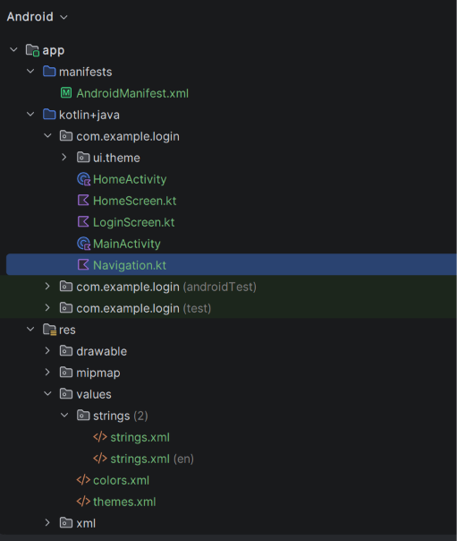
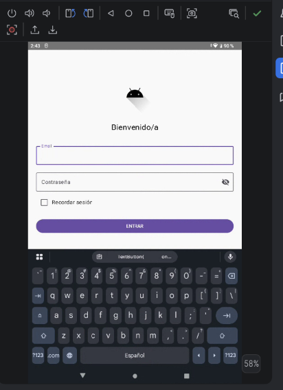
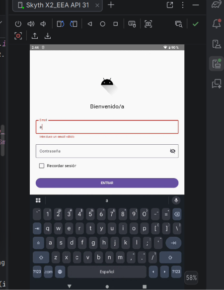
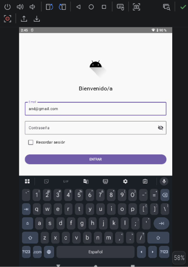
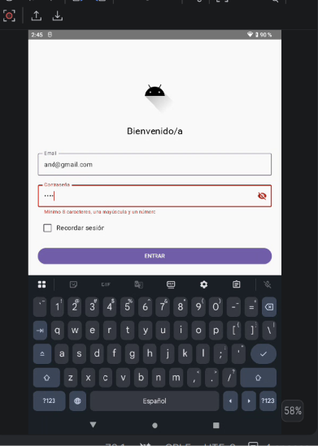
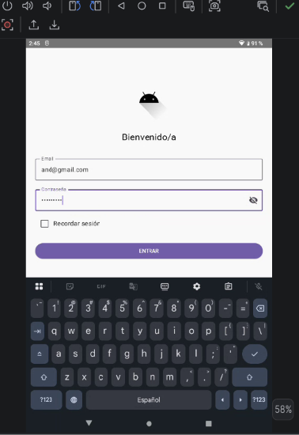
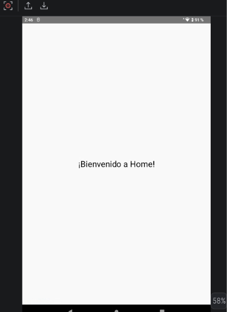
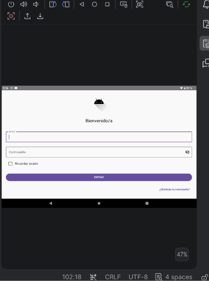
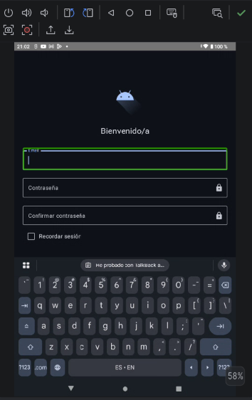
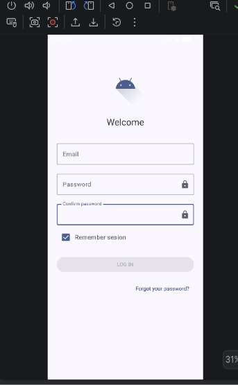

# Memoria · Actividad 2.1 · Pantalla de Login y Navegación Básica (Jetpack Compose)

**Módulo:** Programación Multimedia y Dispositivos Móviles (PMDM) · 2º DAM **Alumna:** Andrea **Fecha:** 8 de octubre de 2026 **Repositorio GitHub:** (https://github.com/mgd02452/PMDM26-27)

## 1. Introducción y objetivos

En esta actividad se ha diseñado e implementado la pantalla de acceso (Login) de una aplicación Android usando **Jetpack Compose** y **Material 3**. Es la primera pantalla que ve el usuario, por lo que se ha cuidado tanto la interfaz como la experiencia de uso.

Objetivos específicos:

- Implementar una interfaz responsiva con `Column` y `Modifier`.
- Usar componentes de Material 3: `OutlinedTextField`, `Button`, `Checkbox`, `TextButton`.
- Programar la validación de email y contraseña.
- Gestionar el foco y el teclado.
- Navegar a una segunda pantalla (`HomeActivity`) mediante `Intent`.

### Competencias trabajadas

| CE | Descripción | Cómo se ha trabajado |
| --- | --- | --- |
| CE.a | Estrategia y estructura de clases de la aplicación | Separación en `MainActivity`, `LoginScreen`, `HomeActivity` y `HomeScreen`. |
| CE.b | Clases de interfaz gráfica | Composables con `Column`, `Row`, `OutlinedTextField`, `Button`, `Checkbox`. |
| CE.g | Pruebas de interacción y optimización en emuladores | Batería de pruebas en el emulador (apartado 6). |
| CE.i | Documentación de los procesos de desarrollo | Esta memoria y el repositorio en GitHub. |

## 2. Estructura del proyecto

Se ha organizado el proyecto de la siguiente forma:

| Archivo | Función |
| --- | --- |
| `AndroidManifest.xml` | Declara las Activities (`MainActivity`, `HomeActivity`), permisos y tema. |
| `MainActivity.kt` | Activity de entrada; carga `LoginScreen` con `setContent { }`. |
| `LoginScreen.kt` | Composable con la UI y la lógica de validación del login. |
| `HomeActivity.kt` | Activity que se abre tras un login correcto. |
| `HomeScreen.kt` | Composable con la UI de la pantalla de destino. |
| `res/values/strings.xml` | Todos los textos de la app (nada escrito a fuego en el código). |
| `res/values/colors.xml` y `themes.xml` | Colores y tema global. |

Se ha respetado la regla de oro de la guía: **los textos nunca se escriben directamente en el código**, sino que se referencian con `stringResource(R.string.…)`.



## 3. Desarrollo de la interfaz (LoginScreen.kt)

La pantalla se construye con una `Column` que ocupa toda la pantalla (`fillMaxSize()`), con `padding(24.dp)`, scroll vertical (`verticalScroll(rememberScrollState())`) y los elementos centrados horizontalmente. De arriba abajo contiene:

1. Logotipo (`Icon`) con `contentDescription` para accesibilidad.
2. Título de bienvenida con el estilo `headlineSmall` del tema.
3. Campo **Email** (`OutlinedTextField`) con teclado de tipo email.
4. Campo **Contraseña** con icono para mostrar u ocultar el texto (`Visibility` / `VisibilityOff`).
5. Fila con `Checkbox` y el texto "Recordar sesión".
6. Botón **ENTRAR** a todo el ancho.
7. `TextButton` "¿Olvidaste tu contraseña?".

Para los iconos se añadió la dependencia `material-icons-extended` en `libs.versions.toml` y en `build.gradle.kts`:

```kotlin
// libs.versions.toml
[libraries]
androidx-compose-material-icons-extended = { group = "androidx.compose.material", name = "material-icons-extended" }

// build.gradle.kts
dependencies {
    implementation(libs.androidx.compose.material.icons.extended)
}
```

**\[Captura 1: vista previa (@Preview) de LoginScreen\]**



## 4. Lógica y validación

### 4.1. Estado

Se usa `remember` y `mutableStateOf` para guardar el email, la contraseña, los mensajes de error y si la contraseña se muestra o no. Cada vez que cambia un estado, Compose recompone la interfaz.

### 4.2. Validación del email

Se comprueba que no esté vacío y que cumpla el patrón estándar de Android (`Patterns.EMAIL_ADDRESS`). Si no es válido, el campo se marca con `isError = true` y se muestra el mensaje con `supportingText`.

### 4.3. Validación de la contraseña

Se exige un mínimo de 8 caracteres, al menos una mayúscula y al menos un número, mediante la expresión regular `^(?=.*[A-Z])(?=.*[0-9]).{8,}$`.

### 4.4. Botón ENTRAR

Al pulsar el botón se validan ambos campos. Solo si los dos son correctos se quita el foco y se ejecuta `onLoginSuccess()`.

### 4.5. Navegación

`MainActivity` pasa a `LoginScreen` la lambda `onLoginSuccess`, que lanza un `Intent` hacia `HomeActivity`. En un proyecto real con Compose se usaría `NavHost`, pero aquí se emplea `Intent` por simplicidad. `HomeActivity` se registró en el Manifest con `android:exported="false"`.

**\[Captura 2: errores de validación en email\]** 




**\[Captura 3: errores de validación en contraseña\]** 




**\[Captura 4: pantalla Home tras un login correcto\]**




## 5. Gestión del foco y del teclado

- `ImeAction.Next` en el email: el teclado muestra "Siguiente" y `focusManager.moveFocus(FocusDirection.Down)` pasa al campo de contraseña.
- `ImeAction.Done` en la contraseña: el teclado muestra "Listo" y `focusManager.clearFocus()` cierra el teclado.
- `LaunchedEffect(Unit) { emailFocusRequester.requestFocus() }`: el foco inicial va al campo de email.
- `android:windowSoftInputMode="adjustResize"` en el Manifest para que el teclado no tape los campos inferiores.

Esto permite rellenar el formulario sin tocar la pantalla entre campos.

## 6. Pruebas en el emulador

| Caso probado | Resultado esperado | Resultado |
| --- | --- | --- |
| Al abrir la app, el foco está en el email | Teclado abierto sobre el email | \[OK\] |

| Email inválido | Error "Introduce un email válido" | \[OK\] |
| Contraseña débil | Error de requisitos mínimos | \[OK / KO\] |
| Botón mostrar/ocultar contraseña | Alterna el texto visible u oculto | \[OK\] |
| Tecla Siguiente en el email | Pasa a contraseña | \[OK\] |
| Tecla Listo en la contraseña | Cierra el teclado | \[OK\] |
| Datos correctos + ENTRAR | Abre `HomeActivity` | \[OK\] |

**\[Captura 5: pruebas en el emulador\]**

**\[Rotacion de pantalla\]**



**\[TalkBack activo\]**



## 7. Limpieza de cadenas de texto localizables

En el código de ejemplo los mensajes de error de validación estaban escritos a fuego ("Introduce un email válido" y "Mínimo 8 caracteres, una mayúscula y un número"). Se han movido a `strings.xml`, donde ya existían como `error_email` y `error_password`. Como las funciones de validación no son `@Composable`, los textos se leen antes con `stringResource` y se usan dentro de ellas:

```kotlin
val errorEmailMsg = stringResource(R.string.error_email)
val errorPasswordMsg = stringResource(R.string.error_password)

fun validarEmail(): Boolean {
    val emailValido = email.isNotBlank() &&
            Patterns.EMAIL_ADDRESS.matcher(email.trim()).matches()
    emailError = if (!emailValido) errorEmailMsg else null
    return emailValido
}

fun validarPassword(): Boolean {
    val regex = "^(?=.*[A-Z])(?=.*[0-9]).{8,}$".toRegex()
    val passValida = regex.matches(password)
    passwordError = if (!passValida) errorPasswordMsg else null
    return passValida
}
```

```xml
<string name="error_email">Introduce un email válido</string>
<string name="error_password">Mínimo 8 caracteres, una mayúscula y un número</string>
```

Así, para traducir la app solo hay que crear `res/values-en/strings.xml` con los mismos nombres y el código no cambia.

## 8. Funcionalidad del checkbox (opcional)

En el ejemplo, el `Checkbox` tenía `checked = false` fijo, por lo que no se podía marcar. Se ha añadido un estado para que se pueda marcar y desmarcar, y que su valor se conserve entre recomposiciones (y también al rotar la pantalla usando `rememberSaveable`):

```kotlin
var recordarSesion by rememberSaveable { mutableStateOf(false) }

Row(
    verticalAlignment = Alignment.CenterVertically,
    modifier = Modifier.fillMaxWidth()
) {
    Checkbox(
        checked = recordarSesion,
        onCheckedChange = { recordarSesion = it }
    )
    Text(stringResource(R.string.recordar_sesion))
}
```

Imports necesarios: `androidx.compose.runtime.saveable.rememberSaveable`.

**\[Captura 6: checkbox marcado\]**



## 9. Reto 1

**\[Describir aquí el reto elegido: enunciado, solución implementada, fragmentos de código relevantes y capturas de evidencia. Enlace al repositorio del reto.\]**

## 10. Accesibilidad

- Los elementos gráficos tienen `contentDescription` (logo y botón de mostrar/ocultar contraseña) para que TalkBack los lea.
- Los botones respetan el tamaño táctil mínimo de 48dp × 48dp.
- Los errores no se comunican solo con color: se muestra también un texto de apoyo (`supportingText`).
- Se recomienda comprobar el contraste (WCAG AA, 4.5:1) y probar con TalkBack.

## 11. Problemas encontrados y soluciones

| Problema | Solución |
| --- | --- |
| `Unresolved reference: stringResource` | Añadir `import androidx.compose.ui.res.stringResource`. |
| `HomeActivity not found` al navegar | Registrar la Activity en el `AndroidManifest.xml`. |
| El teclado tapa el botón | Añadir `android:windowSoftInputMode="adjustResize"`. |
| La UI no se actualiza al cambiar un valor | Usar `remember { mutableStateOf(...) }`. |
| `@Preview` no compila | Importar `androidx.compose.ui.tooling.preview.Preview`. |

## 12. Conclusiones

La actividad ha permitido construir una pantalla de login completa con Jetpack Compose, entendiendo cómo funciona el estado y la recomposición, cómo se validan los datos de entrada, cómo se gestiona el foco y cómo se navega entre pantallas con `Intent`. Además, se ha aplicado la buena práctica de externalizar los textos a `strings.xml` para facilitar la traducción, y se han tenido en cuenta criterios básicos de accesibilidad.

## 13. Enlaces

- Repositorio de la actividad: \[pegar enlace\]
- Repositorio del reto: \[pegar enlace\]
- [Jetpack Compose](https://developer.android.com/jetpack/compose)
- [State and Jetpack Compose](https://developer.android.com/jetpack/compose/state)
- [Material 3 in Compose](https://developer.android.com/jetpack/compose/designsystems/material3)
